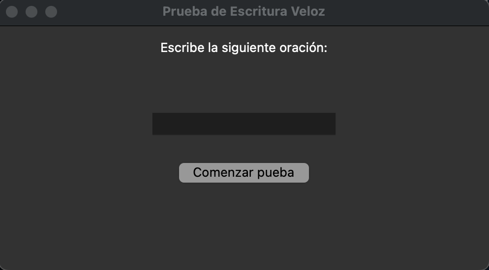
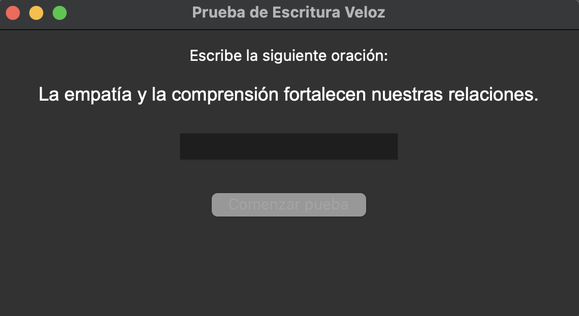
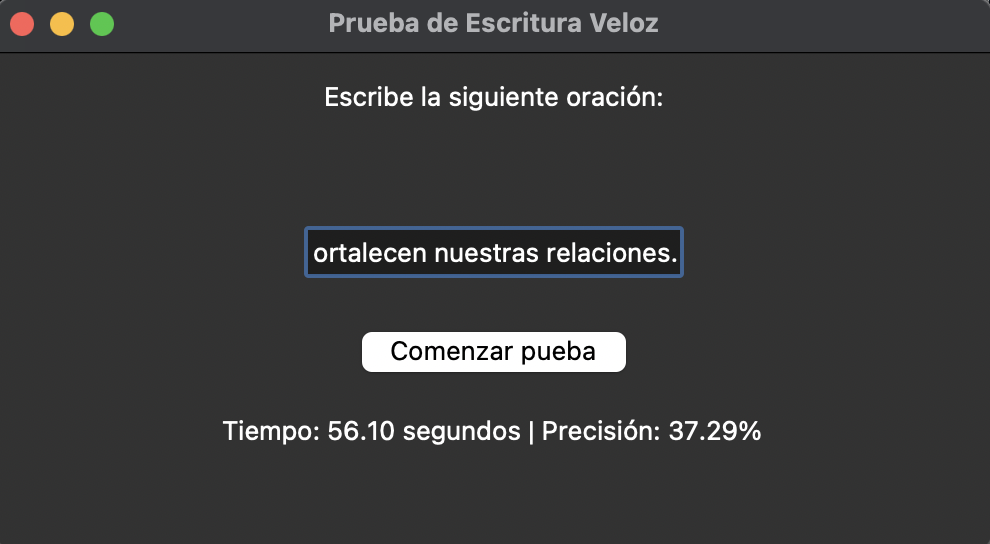

# 🇺🇸 Fast Typing Test 👩‍💻🚀

Welcome to the Fast Typing Test! This is a small project to measure your typing speed and accuracy. Test your skills and improve your times! 🏁📈

## Screenshots 📸

### Start Screen 🚀

- The start screen displays a sample phrase that you must quickly type. 🏁💨
- Click the "Start Test" button to begin. 🚀🚀

### In the Middle of the Test 📝

- During the test, a phrase will be displayed on the screen that you must type as quickly and accurately as possible. ⏱️📝
- Your time and accuracy will be calculated automatically. 📊🔢

### Final Result 🥇

- Once you've finished typing the phrase and pressed Enter, your time and accuracy will be displayed on the screen. 🏆⏱️
- Beat your records and share your results! 🥇🚀

## How to Use 📝

1. Run the program. 🚀
2. Click "Start Test" to initiate the typing test. 📝
3. Type the displayed phrase as quickly and accurately as possible. 💨🎯
4. When you're done, press Enter to view your result. ⏱️📊
5. Share your results and improve your typing speed! 🥇🚀

## Requirements 📋

- Python 3.x 🐍
- Tkinter library (usually included with Python) 🖼️

## License 📜

This project is available under the MIT License - check the [LICENSE.md](LICENSE.md) file for more details. 📜👓

Have fun testing your typing speed and improving your skills! 😄📝

---

# 🇪🇸 Prueba de Escritura Veloz 👩‍💻🚀

¡Bienvenido a la Prueba de Escritura Veloz! Este es un pequeño proyecto para medir tu velocidad de escritura y precisión. ¡Pon a prueba tus habilidades y mejora tus tiempos! 🏁📈

## Capturas de Pantalla 📸

### Interfaz de Inicio 🚀

- La interfaz de inicio muestra una frase de ejemplo que debes escribir rápidamente. 🏁💨
- Haz clic en el botón "Comenzar prueba" para empezar. 🚀🚀

### En Plena Prueba 📝

- Durante la prueba, se mostrará una frase en la pantalla que debes escribir lo más rápido y preciso posible. ⏱️📝
- Tu tiempo y precisión se calcularán automáticamente. 📊🔢

### Resultado Final 🥇

- Una vez que hayas terminado de escribir la frase y presionado Enter, se mostrará tu tiempo y precisión en la pantalla. 🏆⏱️
- ¡Supera tus récords y comparte tus resultados! 🥇🚀

## Cómo Usar 📝

1. Ejecuta el programa. 🚀
2. Haz clic en "Comenzar prueba" para iniciar la prueba de escritura. 📝
3. Escribe la frase que se muestra lo más rápido y preciso posible. 💨🎯
4. Cuando termines, presiona Enter para ver tu resultado. ⏱️📊
5. ¡Comparte tus resultados y mejora tu velocidad de escritura! 🥇🚀

## Requisitos 📋

- Python 3.x 🐍
- Biblioteca Tkinter (normalmente incluida con Python) 🖼️

## Licencia 📜

Este proyecto está disponible bajo la Licencia MIT License - consulta el archivo [LICENSE.md](LICENSE.md) para más detalles. 📜👓

¡Diviértete probando tu velocidad de escritura y mejorando tus habilidades! 😄📝

